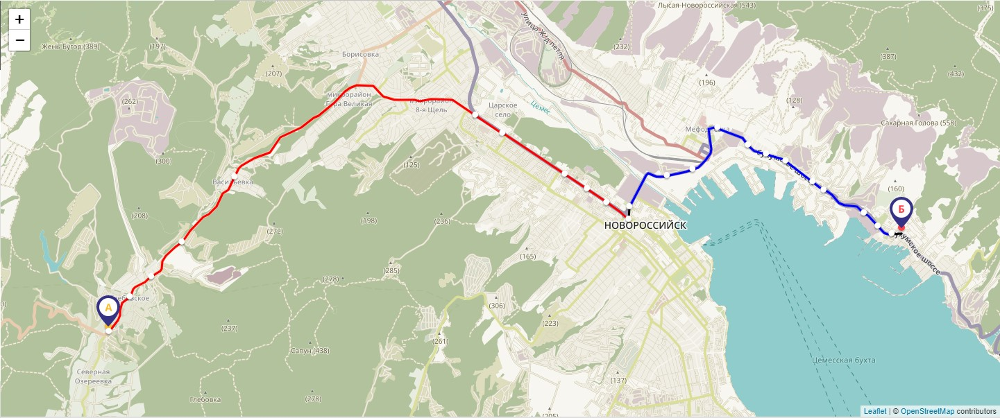

# Golang. Планировщик маршрутов на основе данных GTFS (общедоступный формат описания расписаний движения общественного транспорта)

Позволяет найти оптимальный маршрут с пересадками и без для нужного периода времени. В качестве входных данных требуются координаты начальной и конечной точек, остальное опционально. Возвращает массив вариантов маршрутов, упорядоченный по времени маршрута от меньшего к большему.

Вызов `findpath -start_point="47.2185079:47.2185079" -end_point="47.2094307:39.7385178" -time_type=0 -time="12:27" -date="2019-05-13" -route_type="704,1501,900,800,999,701,100" -change_time=15 -walk_max=500 -walk_speed=4 -routes="" -route_id=""`

